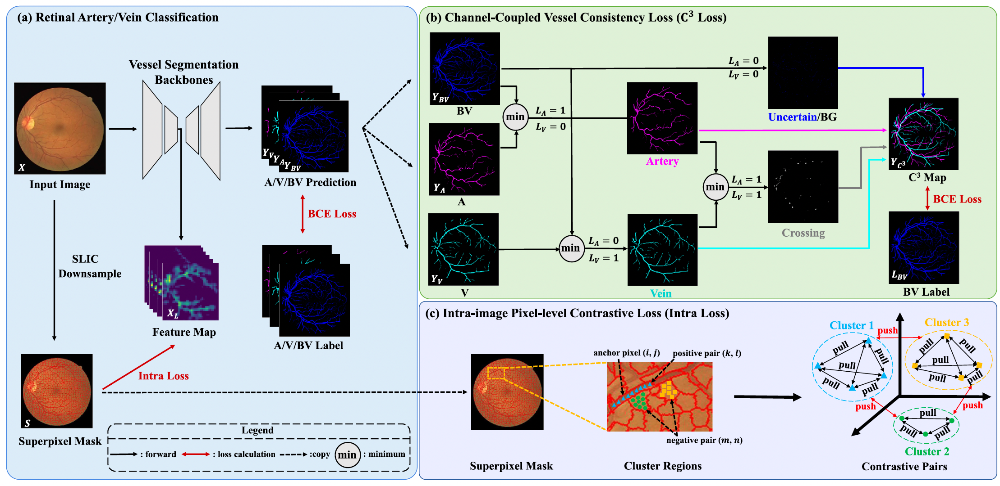

# Improve Retinal Artery/Vein Classification via Channel Coupling

[](https://doi.org/10.1016/j.eswa.2025.130795)
[](https://github.com/stevezs315/AV_seg)
[](https://stevezs315.github.io/)

**Shuang Zeng, Chee Hong Lee, Kaiwen Li, Boxu Xie, Ourui Fu, Hangzhou He, Lei Zhu, Yanye Lu, Fangxiao Cheng**

*MILab, Department of Biomedical Engineering, Peking University*

*Corresponding Author: yanye.lu@pku.edu.cn*

---

## Introduction

Retinal artery/vein (A/V) classification is important for quantitative fundus-image analysis, but it is challenging because arteries and veins are thin, locally ambiguous, and tightly coupled with the global vessel tree.

We propose a channel-coupled A/V segmentation framework for retinal fundus images. The model predicts artery, vein, and vessel-tree channels jointly, and uses channel coupling to encourage structural consistency between the A/V branches and the complete vessel map.

-**Three-channel A/V formulation**: predicts artery, vein, and vessel-tree channels (`A`, `V`, `VT`) together.

-**Channel-coupling loss**: enforces consistency between artery/vein predictions and vessel-tree prediction.

-**Superpixel contrastive regularization**: introduces intra-image pixel-level contrastive learning guided by superpixel regions.

-**Recursive refinement**: supports RRWNet-style iterative refinement for vessel topology and A/V consistency.

-**Evaluation toolkit**: includes A/V, binary-vessel, topology-oriented, and significance-test utilities.

> **TL;DR:** Our method jointly models arteries, veins, and the full vessel tree, using channel coupling and superpixel-guided contrastive learning to improve A/V consistency and preserve fine retinal vessel structures.

---

## News

-**[2026-04-05]** Paper published in *Expert Systems With Applications*, Volume 305, Article 130795.

-**[2025-12-22]** DOI available: [10.1016/j.eswa.2025.130795](https://doi.org/10.1016/j.eswa.2025.130795).

---

## Method Overview



The framework uses a three-channel output representation:

1.**Artery channel**: predicts artery pixels.

2.**Vein channel**: predicts vein pixels.

3.**Vessel-tree channel**: predicts the complete vessel structure.

The main training objective combines:

```bash

Total Loss = Basic BCE Loss + Channel-Coupled Vessel Consistency Loss + Intra-image Pixel-level Contrastive Loss
```

**Key modules:**

- **Channel-Coupled Vessel Consistency Loss**: A novel loss that enforces anatomical coherence among artery, vein, and vessel predictions by fusing them through min‑operations based on ground‑truth class labels, ensuring that arterial and venous predictions remain consistent with the overall vascular structure.
- **Intra-image Pixel-level Contrastive Loss**:   A regularization term that leverages superpixel segmentation to guide unsupervised contrastive learning, treating pixels within the same superpixel cluster as positive pairs and those from different clusters as negative pairs, thereby promoting more discriminative fine‑grained feature representations.

---

## Installation

```bash
conda create -n av_seg python=3.8.16
conda activate av_seg
pip install -r requirements.txt
```

---

## Model Weights and Predictions

Pre-trained model weights: "AV_Seg/model_pth"

| Model                 | train/test Dataset | Backbone          |
| ----------------------| -------------------| ------------------|
| RITE_generator_best   | RITE               | RRWNet + Our Loss |
| LES-AV_generator_best | LES-AV             | RRWNet + Our Loss |
| HRF_generator_best    | HRF                | RRWNet + Our Loss |

---

**The final predictions of RRWNet with our proposed loss can be found at "AV_Seg/predictions"**

## Dataset Preparation


All fundus datasets provide color retinal images with A/V annotations. Labels are stored as three-channel maps (`A`, `V`, `VT`), where artery and vein are subsets of the complete vessel tree.

| Dataset | Description | Training resolution | Images | 
| ------- | ----------- | ------ | ------ |
| RITE / DRIVE A/V | A/V benchmark derived from DRIVE | Full resolution (565 × 584)| 40 (20 train / 20 test) |
| LES-AV | A/V benchmark with glaucoma cases | Width resized to 576 px | 22 （11 train / 11 test） |
| HRF | High-resolution fundus with A/V labels | Width resized to 1024 px | 45 (30 train / 15 test)  |
| Fundus-AVSeg | Multi-disease fundus A/V segmentation | Resized to 1280 × 1280| 100 (80 train / 20 test) |

- RITE, [link](https://drive.google.com/file/d/154XKN2umLFXaghhXW--rIgDNzNRa4bxB/view?usp=drive_link)
- LES-AV, [link](https://drive.google.com/file/d/1MHK11qGJTDEpmvieJM0T0Q-799Iwvwjh/view?usp=drive_link)
- HRF, [link](https://drive.google.com/file/d/1JPsfHkk4Li_9EeXbJ5ZKUo7Y9qpYIrj7/view?usp=drive_link)
- Fundus-AVSeg, [link](https://drive.google.com/file/d/1sMJMa4XSMqta8LWMOISPv-J_DY7l76lo/view?usp=drive_link)

---

### Pre-Processing

All fundus images undergo offline preprocessing before training, including **global contrast enhancement** and **local intensity normalization**, following [Morano et al., 2021](https://doi.org/10.1016/j.media.2021.103274).

If field-of-view masks are unavailable, generate them with:

```bash
python generate_mask.py
```

Enhance fundus images with:

```bash
python preprocessing.py \
  --images-path train/_Data/<dataset>/training/images \
  --masks-path train/_Data/<dataset>/training/masks \
  --save-path train/_Data/<dataset>/training/enhanced
```

For a new dataset:

1. Split images into train/test sets.
2. Prepare FOV masks and three-channel A/V/VT labels.
3. Run image enhancement if needed.
4. Register the dataset in `train/config.py`.

---

## Training

Run training from the `train/` directory:

```bash

cdtrain

python3train.py\

  --dataset RITE-train \

--versionRITE_RRWNet_coupled_spcl\

  --model RRWNet \

--gpu_id0\

  --base_criterion BCE3wminmaxLoss \

--add_criterionSpCLLoss
```

Useful arguments:

| Argument | Description |

| -------- | ----------- |

| `--dataset` | Dataset name, such as `RITE-train`, `LES-AV`, `HRF-Karlsson-w1024`, or `Fundus-AVSeg` |

| `--model` | Network backbone, such as `RRWNet`, `UNet`, `UNet_pp`, `Rolling_Unet_M`, or `RSFConvUnet` |

| `--base_criterion` | Base loss, usually `BCE3Loss` or `BCE3wminmaxLoss` |

| `--add_criterion` | Additional loss, for example `SpCLLoss` |

| `--recursive_criterion` | Optional recursive regularizer, such as `BCE3Loss`, `SVoxelLoss`, `D25Loss`, or `topoLoss` |

| `--num_iterations` | Number of recursive refinement iterations |

| `--version` | Experiment folder name under `train/__training/` |

Training outputs are saved to:

```text

train/__training/<version>/
```

The most useful inference checkpoint is usually `generator_best.pth`. `checkpoint_final.pth` indicates a completed run.

---

## Inference

Run inference from the `train/` directory and save predictions under `eval/_Evaluation_Data/`:

```bash

cdtrain

python3test.py\

  --weights __training/RITE_RRWNet_minmax_0.19_spCL_0.05 \

--images_path_Data/RITE/test/enhanced\

  --masks_path _Data/RITE/test/enhanced_masks \

--test_nameRITE-test\

  --save_root ../eval/_Evaluation_Data \

--save_pathRITE_RRWNet_coupled_spcl
```

The prediction folder will be:

```text

eval/_Evaluation_Data/RITE-test/RITE_RRWNet_coupled_spcl/
```

---

## Evaluation

For arbitrary prediction, ground-truth, and mask folders:

```bash

cdeval

pythonevaluate.py\

  -d RITE-test \

-p_Evaluation_Data/RITE-test/RITE_RRWNet_coupled_spcl\

  -g _Evaluation_Data/RITE-test/gt_hu \

-m_Evaluation_Data/RITE-test/masks\

  -t mav \

--pixelsboth
```

For dataset-specific comparison:

```bash

cdeval

pythoncompare_results.py\

  -d RITE-test \

-p_Evaluation_Data/RITE-test/RITE_RRWNet_coupled_spcl\

  -v RITE_RRWNet_coupled_spcl
```

Main evaluation modes:

| Mode | Description |

| ---- | ----------- |

| `mav` | Artery/vein and vessel-tree classification metrics |

| `topo_mp` | Topology-oriented metrics |

| `--pixels both` | Evaluate both full-vessel and intersection-pixel settings |

| `--pixels intersection` | Evaluate only the artery/vein intersection region |

| `--pixels all` | Evaluate all vessel pixels |

JSON results are written to `eval/__results/`. The helper scripts `eval/resultsxls.py` and `eval/topo_resultsxls.py` convert selected JSON outputs to Excel files.

---

## Project Structure

```text

AV_seg/

├── train/                         # Training, inference, models, losses, data loaders

│   ├── train.py                   # Main training entry point

│   ├── test.py                    # Prediction / inference entry point

│   ├── config.py                  # Dataset and training configuration

│   ├── factories.py               # Model and loss factories

│   ├── models.py                  # RRWNet / UNet-style model definitions

│   ├── losses.py                  # BCE3, channel-coupling, SpCL, topology losses

│   ├── networks/                  # Baseline network implementations

│   └── supervoxel_loss/           # Supervoxel / topology-related losses

├── eval/                          # Metric computation and result conversion

│   ├── evaluate.py                # Evaluate arbitrary prediction / GT / mask folders

│   ├── compare_results.py         # Dataset-specific comparison workflow

│   ├── constants.py               # Dataset definitions for evaluation

│   ├── topo_metric.py             # Topology metrics

│   └── resultsxls.py              # JSON-to-Excel conversion helper

├── detailed_evaluation/           # Extended topology and significance evaluation

├── crossing/                      # Vessel crossing / endpoint analysis utilities

├── micro_vessel/                  # Micro-vessel ROI analysis utilities

├── data_processing/               # Dataset conversion and distribution helpers

├── preprocessing.py               # Fundus enhancement and ROI-mask erosion

├── generate_mask.py               # Field-of-view mask generation

├── recolor_av3_labels.py          # Convert / recolor A/V labels

├── result.png                     # Example prediction figure

├── requirements.txt

├── LICENSE

└── README.md
```

---

## Open-Source Notes

Before redistributing this repository, please review the following:

- Remove private or non-redistributable data, including private large-field datasets and local experiment outputs.
- Respect licenses for RITE/DRIVE, HRF, LES-AV, GAVE, Fundus-AVSeg, and any other third-party datasets.
- Move large artifacts such as `train/__training/`, `eval/_Evaluation_Data/`, `eval/__results*/`, `.pth`, `.zip`, and `.xlsx` files to release assets or external storage.
- Replace hard-coded absolute paths in configuration files or scripts with relative paths or command-line arguments.
- Verify the license compatibility of copied baseline network implementations.
- If the local paper PDF is not redistributable, remove it and link to the DOI instead.

Suggested `.gitignore` entries:

```gitignore

train/_Data/

train/__training/

eval/_Evaluation_Data/

eval/__results*/

large_field_private/

*.zip

*.pth

*.xlsx

__pycache__/

*.pyc
```

---

## Citation

If you find this repository useful in your research, please cite our paper:

```bibtex

@article{zeng2026channelcoupling,

title = {Improve retinal artery/vein classification via channel coupling},

author = {Zeng, Shuang and Lee, Chee Hong and Li, Kaiwen and Xie, Boxu and Fu, Ourui and He, Hangzhou and Zhu, Lei and Lu, Yanye and Cheng, Fangxiao},

journal = {Expert Systems With Applications},

volume = {305},

pages = {130795},

year = {2026},

doi = {10.1016/j.eswa.2025.130795}

}
```

Please also cite the original RRWNet work if you use the recursive refinement architecture or its evaluation protocol.
